# Oque você está procurando?⠀👀

## Sobre mim 🚶‍♂️

   

    📅 Eu estudei e pratiquei por <b>254 dias</b>  
    💻 Atualmente focado em <b>Desenvolvimento Front-End</b>  
    🖋️ Usando todo tempo livre para <b>estudos</b>  
    👀 Meu artigo <a href="https://simplifiedknowledge.vercel.app/blog/middlewares-no-express" target="_blank" >mais recente</a>!

     

## Meus Conhecimentos 🧠

   

    
    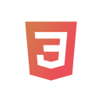
    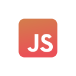
    
    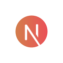
    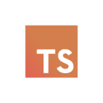

 

    
    
    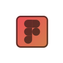
    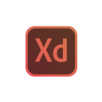

   

<table>
 <tr>
    <td align="center"><h3>Atualmente Estudando 📖</h3></td>
    <td align="center"><h3>Oque eu quero estudar para 2022 🔮</h3></td>
 </tr>
 <tr>
    <td align="center">
        
        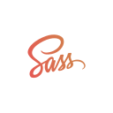
        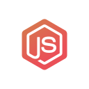
    </td>
    <td align="center">
        
        
        
        
        
    </td>
 </tr>
</table>
       

<h2 align="center">Feature Projects 🎉</h2>

 
<table align="center">
 <tr>
    <td align="center"><h3>Pré-visualização 🖼️</h3></td>
    <td align="center"><h3>Objetivos de Projetos 🏆</h3></td>
 </tr>
 <tr>
    <td align="center">
        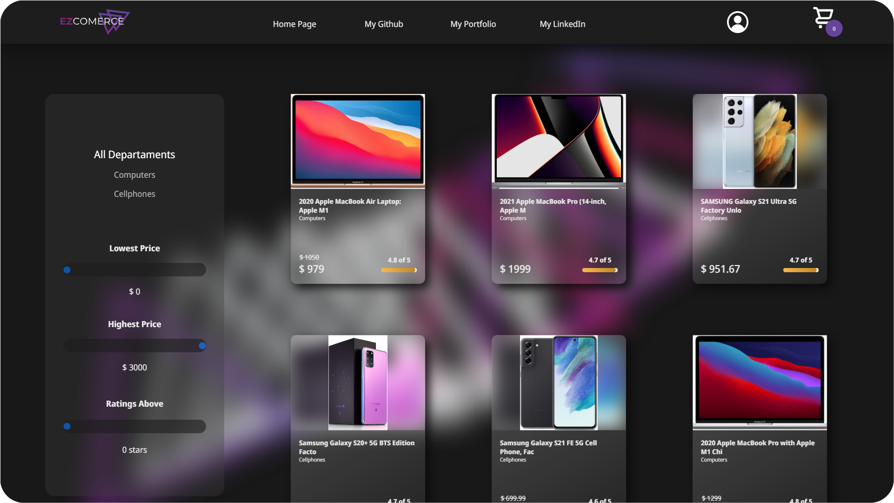
    </td>
    <td align="center">
       • Adicionar mais produtos ✔️  
       • Adicionar funcionalidade de carrinho ✔️  
       • Adicionar mais páginas ✔️  
       • Procura por nome   
    </td>
 <tr>
    <td align="center">
        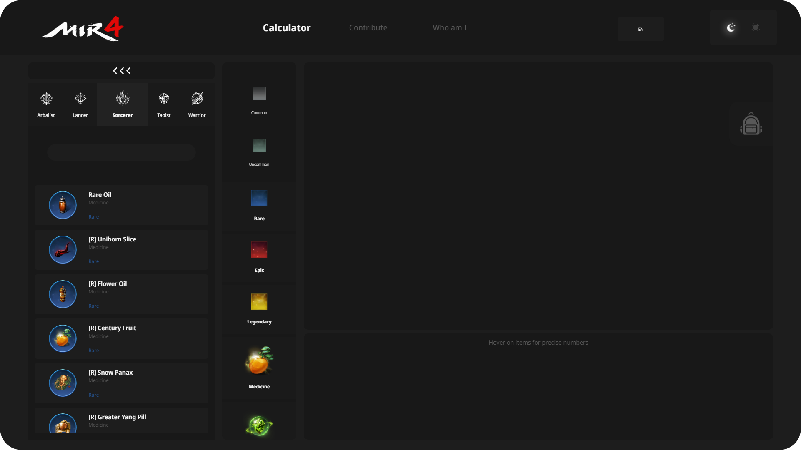
    </td>
    <td align="center">
       • Adicionar items restantes ✔️   
       • Animação de colapsar na lista de items ✔️   
       • Feature de inventário para escolher os items atuais ✔️   
       • Mais ferramentos de calculos...   
    </td>
 </tr>
 <tr>
    <td align="center">
        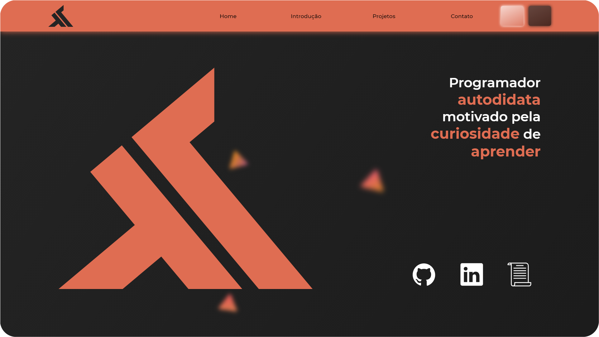
    </td>
    <td align="center">
       • Opções de Linguagems ✔️  
       • Design Responsivo ✔️  
       • Carrosel de Imagem ✔️  
    </td>
</table>
