<h2>Where to find me 🗺️</h2>
 

<h2>About me 🚶‍♂️</h2>
 

<h3 align="center">Statistics 🧐</h3>  

    💻 <b>Currently focused on -</b> SEO & Testing  
    👀 <a href="https://simplifiedknowledge.vercel.app/blog/boost-code-readability" target="_blank" >Latest article</a>

 

  
